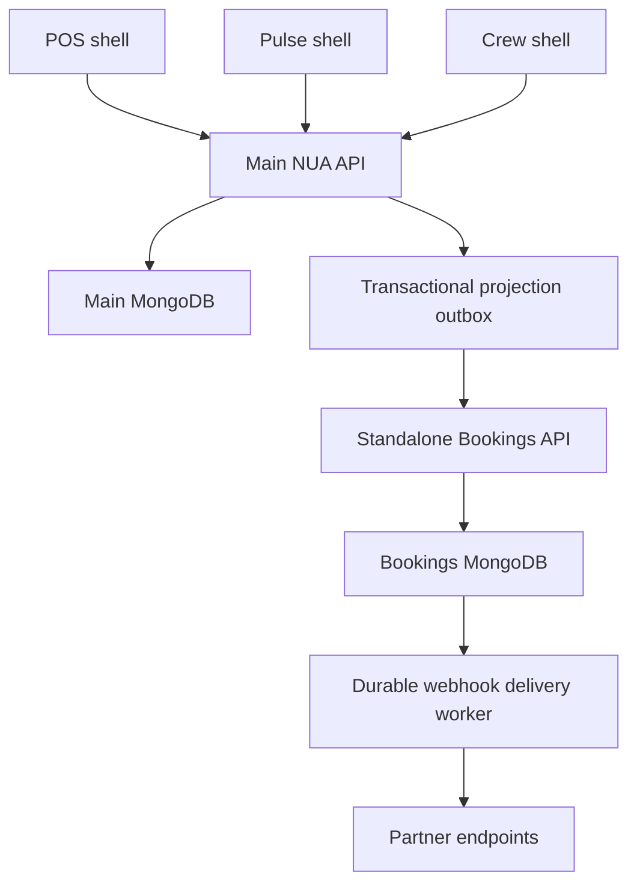

# NUA Product Architecture and Delivery Contract

Updated: 24 September 2026
Repository: https://github.com/Sam-NUA/NUA
Inspected baseline: `main` at `a8f4f190f328c1ea8242e0d0a9f72089f672c20d`
Implementation branch: `codex/deployment-readiness` (builds on reliability PR #3)
Status: transactional bookings, durable projections and release gates implemented for review; broader platform programme remains open. This is not a production-readiness certification.

## 1. What NUA is becoming

NUA is a shared business platform with focused products for counter staff, owners, employees, reservations and marketing. Keep the shared codebase and shared business identity. Extract services only when independent operation, scaling or release ownership justifies it.

A product name, app icon, route, deployment and subscription entitlement are different things. Document each separately. A route file does not establish a standalone product; a PWA manifest does not prove offline operation or an app-store release.

| Product | Customer outcome | Current packaging verified in source | Target contract |
|---|---|---|---|
| NUA POS / Counter | Take orders, collect payments, coordinate service | Main React frontend and Python backend | Core operational application; explicit payment state and recovery |
| NUA Pulse | Understand performance and resolve exceptions | `OwnerDashboardApp.jsx`, `/owner-dashboard`, owner manifest | Owner experience on shared platform; evidence-backed insights and approvals |
| NUA Crew | Know shifts, record attendance, complete work | `StaffApp.jsx`, `/staff-app`, staff manifest | Employee experience with staff-specific permissions and complete workflows |
| NUA Bookings | Accept reservations and enforce capacity | Separate `bookings-api` FastAPI application and database | Independently operable booking service with one authority per venue |
| Embedded social planning | Prepare content and calendar | `routes/social_media.py`, `SocialMedia.jsx`, marketing hub | Honest planning capability until a real publishing adapter is verified |
| Standalone NUA Social | Connect accounts, publish and measure campaigns | Not established by inspection of this repository | Separate product, integrated through a defined API; verify its repository before reuse |
| Ash AI | Explain, recommend and assist | AI routes, planner, tools, trust controls and approvals | Shared assistant constrained by user permission, entitlement and action policy |

Pulse and Crew share the frontend build, backend, database and authentication with POS. Their manifests and hostname shells establish distinct experiences, not deployment independence. The `?shell=` override and saved local override are presentation mechanisms only.

## 2. Current system map

Evidence: `frontend/src/lib/appShell.js`, `frontend/public/manifest.owner.json`, `frontend/public/manifest.staff.json`, `backend/services/reservation_store.py`, `backend/services/booking_sync.py`, `bookings-api/server.py`, `bookings-api/database.py`, `bookings-api/webhooks.py`.

Both outbound paths are durable. Native reservations and their latest projection commit together; standalone bookings, usage and webhook events commit together. Delivery workers use expiring claims and retain failures. Both services now require a MongoDB replica set for these transactional writes.

## 3. Changes implemented in the initial delivery

| ID | Change | Evidence / verification scope |
|---|---|---|
| F01 | Sandbox keys can only access sandbox venues; live keys cannot reach those venues. Historical venues without a test flag remain live. Booking and waitlist queries also separate legacy sandbox records. | `bookings-api/routes_v1.py`, `allocation.py`, `models.py`; API boundary regressions |
| F02 | Optional `Idempotency-Key` on booking creation. Partner/environment-scoped key and request hash are stored in the booking's atomic insert. A repeated request returns the same booking; different payload reuse returns 409. | `routes_v1.py`; retry, collision and concurrent-insert regressions |
| F03 | Pending webhook deliveries survive worker restart. Mongo atomic claims, expiring leases, token-checked acknowledgements, bounded retries and retained failure records replace request-spawned delivery tasks. | `webhooks.py`, lifespan in `server.py`; recovery and timeout regressions |
| F04 | POS projection requires an explicit business mapping. All route/service writers use the reservation store; transactions retain versioned snapshots and deletion tombstones. Native capacity locks are fenced at commit. A resident worker delivers to external-authority venues; owners/managers can inspect and retry failures. | `backend/services/bookings_partner_client.py`; configuration and tenant regressions |
| F05 | Embedded social cannot manufacture publication success. Publish returns 503 without modifying the draft; create/edit reject client-supplied provider outcomes. Old stub publications display as simulated. | `backend/routes/social_media.py`; HTTP and stored-state regressions |
| F06 | Social UI explains planning-only availability and disables publication actions. | `frontend/src/pages/SocialMedia.jsx`; production build gate |
| F07 | Bookings service tests are added to CI. | `.github/workflows/ci.yml` |
| F08 | Direct partner provisioning strips Mongo's internal ObjectId from its response. | `bookings-api/routes_admin.py`; exercised by public API setup in new tests |

### Transactional release follow-up

- Venue-fenced transactions serialize standalone capacity decisions. Twelve competing requests and two independent processes each prove one winner for the final table on real MongoDB. Repeated keys return one booking; event-write failure rolls back booking and usage.
- Canonical UTC intervals support equivalent offsets, venue-local dates and overnight service. Ambiguous/nonexistent DST times require explicit offsets. A dry-run-first per-venue migration handles legacy records; active unmigrated records block new allocation.
- Waitlist promotion and explicit seating reserve actual inventory atomically. Repeated seating returns the existing booking; restoring cancelled bookings rechecks capacity.
- Native create/update/delete and projection intent commit together. Latest-state delivery coalesces changes; versioned tombstones prevent stale resurrection. Expired capacity leases cannot commit reservations. Inbox conversion recovers repeated requests and a crash before acknowledgement.
- Partner events are HMAC signed with timestamps and stable IDs. Delivery requires operator-approved HTTPS hosts, disables redirects and exposes failed deliveries/retries. Receiver deduplication and egress restrictions remain deployment responsibilities.
- Real replica-set transaction tests run in CI and gate Fly deployment. Compose initializes a replica set; readiness routes check database topology. See `DEPLOYMENT_READINESS.md` for configuration, migration and rollback.

Current local evidence: 818 backend regression tests passed, 35 Bookings tests passed, 12 real MongoDB transaction tests passed, plus focused inbox recovery and writer-boundary checks. Error-only lint and the existing type baseline (814) passed. Earlier reliability PR #3 CI passed; the new commit requires its own CI. No live deployment or provider smoke was completed.

Scope limits: one static native business/venue mapping per deployment; no automated authority cutover or historical projection backfill. Delivery is at least once and unordered. HMAC receivers must dedupe and reject stale timestamps. Host allowlisting is not DNS pinning; enforce egress rules. Operator retry metadata is not a complete audit journal. These changes do not finish the broader product backlog.

## 4. Readiness evidence matrix

“Present” means source was inspected, not that a live deployment was validated. Existing test files are evidence of intended coverage; count only current execution results as passed tests.

| Capability | Source evidence | Integration reality | Live validation | Remaining gate |
|---|---|---|---|---|
| Pulse/Crew shells | Present | Shared app and authentication | Not performed | Mobile install, roles, data freshness and workflow smoke |
| Main tenant isolation | Strict helpers and many regression suites present | `tenant_scope_filter`, `tenant_owns_strict` | Not performed | Exact-head CI plus two-tenant deployed checks |
| Payment safeguards | Idempotency and financial integrity services/tests present | Provider configuration not inspected | Not performed | Sandbox processor reconciliation and ambiguous timeout drill |
| Native booking rules | Rules engine, commit fencing and shared store | Real-Mongo contention/expiry tests passed | Not performed | Deployed smoke and sustained contention |
| Standalone booking boundary | Atomic allocation and UTC normalization | Real-Mongo concurrency/rollback tests passed | Not performed | Legacy time migration and deployed contention |
| POS booking mirror | Durable versioned projection with tombstones | One explicit mapping; atomic native writes | Not performed | Historical backfill, dynamic mappings and deployed recovery |
| Bookings webhooks | Atomic enqueue, signatures, claims and retries | Signed HTTP delivery tested with fake receiver | Not performed | Resident runtime, actual receiver/egress/replay proof |
| Embedded social | Planning and AI routes present | Mock account connection; no provider publisher | Not performed | Real OAuth and adapter with provider acknowledgement |
| Standalone NUA Social | Outside this repository review | Unknown here | Not performed | Identify source and integration contract |
| Offline POS | Queue code and integrity tests present | Not equivalent to offline card authorisation | Not performed | Device reconnection and settlement proof |
| Backups | Backup and drill services/tests present | Storage configuration not inspected | Not performed | Restore to isolated database and measure recovery |
| Vercel staging | Existing draft PR #2 observed open | Deployment not verified in this task | Not performed | Environment provisioning, worker placement and live smoke |

Historic reports under `backend/TRUST_RELEASE_*` describe older commits and PR #95 in the previous repository. They are historical evidence, not the current release verdict. Current main already includes stricter ownership behaviour than some older reports describe.

## 5. Target module boundaries and data ownership

Use explicit service interfaces within the current backend first. A module owns its writes; other modules request operations or consume projections. Tenant identity must originate in authenticated membership or a verified public venue selector, never an arbitrary UI field.

| Domain | Authoritative writer | Consumers | Required invariant |
|---|---|---|---|
| Organisation, venue and membership | Identity/access module | All products | Missing tenant fails closed; role and object ownership checked server-side |
| Catalogue, modifiers and price lists | Catalogue module | POS, ordering, Bookings, Social | Versioned items; external IDs mapped per source and venue |
| Orders and service state | Order module | Kitchen, payments, reporting | Explicit legal state transitions and idempotent commands |
| Payments, refunds, gift liability | Payment/ledger modules | POS, finance, Pulse | Provider reference + durable journal; unknown outcome never becomes assumed success |
| Booking inventory and reservations | Exactly one configured authority per venue | POS, guest channels, Pulse | No independent confirmations against shared capacity |
| Staff identity, time and shifts | Workforce module | Crew, payroll, Pulse | Self-access versus manager actions separated; corrections audited |
| Inventory and recipe costing | Inventory module | Orders, purchasing, Pulse | Explainable stock movements and valuation inputs |
| Customer preferences and consent | CRM/consent module | Bookings, loyalty, Social | Purpose-specific consent; export/deletion reaches downstream processors |
| Campaigns and publications | Verified Social product/service | POS marketing hub, Pulse | Published only after provider acknowledgement; stable provider IDs |
| Reporting projections | Reporting module | Pulse and enterprise views | Rebuildable projections; freshness and calculation definitions shown |
| Subscription entitlements | Billing/entitlement module | All APIs | Payment webhooks deduplicated; access revocation policy explicit |
| AI decisions and execution | Ash with module-owned commands | All products | No direct unrestricted DB mutation; actor authority survives background execution |

Keep MongoDB until an evidence-based decision supports changing it. Define replica-set/transaction requirements, indexes, backup and recovery before introducing cross-document atomic workflows. Do not add Redis, a broker, new services or databases merely because the target diagram has modules.

## 6. Booking authority decision

For existing POS venues, native reservations remain authoritative until an explicit cutover is completed. The optional current mirror is not permission to accept independent confirmations in both systems.

Target configuration per venue:

- `authority = native`: all confirmed capacity decisions route to native reservations. A Bookings representation is a projection and must not independently sell that inventory.
- `authority = bookings`: all confirmed capacity decisions route through the standalone service. If unavailable, POS accepts a pending request, not a guaranteed reservation.
- Never silently change authority on an outage. A local fallback that independently confirms can oversell.

Standalone venue `authority` is now enforced as `platform` (local confirmation) or `external` (projection only). Native POS remains authoritative for mapped external venues. Automatic cutover and dynamic mapping management are not implemented; do not enable simultaneous independent sales of shared capacity.

Cutover steps: inventory all creation/mutation paths; reconcile IDs and counts; snapshot data; freeze confirmations briefly; import and reconcile; flip one authority flag; reopen; monitor. Roll back only after reconciling bookings created since the switch. Cancellation, reschedule, approval, seat, completion, no-show, deletion and restore must all have explicit propagation semantics.

The durable integration contract must record state change and event intent atomically (transaction or single-document embedded event). Events carry tenant, venue, aggregate ID, version, event ID and correlation ID. Consumers deduplicate and reject stale versions. Deletes use a retained tombstone until required delivery is acknowledged. Do not send an asynchronous cancellation before an irreversible local delete without a recoverable state machine.

## 7. Failure behaviour and operating targets

Targets below are proposed engineering gates, not measured service promises.

| Failure | Required behaviour | Acceptance evidence |
|---|---|---|
| POS loses connectivity | Show offline status; queue only permitted operations | Device restart and reconnect produce one sale and one stock/ledger effect |
| Payment request times out | Preserve unknown/pending state; query provider before retry | Same reference never causes duplicate charge or refund |
| Booking authority unavailable | Pending request with clear guest wording | No false confirmed response; reconciliation resolves pending work |
| AI unavailable | Manual workflow remains usable | Checkout and bookings do not depend on an AI response |
| Partner webhook fails | Durable retry; visible exhausted delivery | Kill/restart worker; receiver deduplicates repeated event |
| Social provider rejects content | Failed delivery with actionable reason | No published state without provider post ID/acknowledgement |
| Reporting projection lags | Show last refreshed timestamp | Owner sees stale-data indicator rather than unexplained numbers |
| Database lost | Restore to isolated target; reconcile provider state | Measured recovery time and data loss against agreed RTO/RPO |

Initial targets to validate: critical internal API p95 under 500 ms excluding external providers; event lag p95 under 60 seconds; alert on oldest pending delivery over 5 minutes; proposed RPO 15 minutes and RTO 60 minutes. Load model must specify venues, terminals, peak bookings and order rate before claiming scale.

## 8. Prioritised delivery backlog

OPEN and PARTIAL items below are unfinished. IMPLEMENTED items still require the stated migration/live release gates. They must not be reported as delivered because this document exists.

| ID | Priority / status | Work | Acceptance criteria and dependency |
|---|---|---|---|
| A01 | P0 / DONE IN BRANCH | F01–F08 foundation changes | Focused regressions pass; exact-head CI and staging remain release gates |
| A02 | P0 / PARTIAL | Booking authority and durable POS outbox | All writers inventoried; atomic enqueue; restart-safe delivery; cancel-before-create and delete/retry tests; owner-visible reconciliation. Depends on authority decision and DB topology |
| A03 | P0 / IMPLEMENTED; LIVE GATE OPEN | Atomic standalone capacity | Two independent processes competing for last table produce exactly one confirmation. Include reschedule, restore, expired lock, waitlist and cross-midnight cases on real Mongo |
| A04 | P0 / IMPLEMENTED; MIGRATION GATE OPEN | Canonical booking times | Store/compare canonical instants; resolve venue timezone; reject invalid ranges and ambiguous DST inputs explicitly. Test equivalent offsets, overnight service and transitions |
| A05 | P0 / PARTIAL | Booking side effects and webhook security | Booking + usage/event intent atomic; signed timestamped webhooks, receiver replay protection, safe endpoint validation, audited retries, failed-delivery view; kill between each write boundary |
| A06 | P0 / OPEN | Exact-head deployed security/recovery evidence | Run role/tenant tests, real Mongo tests, payment timeout drill, backup restore and edge trust checks. No broad new permission bypasses |
| A07 | P1 / OPEN | Pulse daily decision workflow | Freshness labels, margin methodology, refund anomalies, stock risks, ranked action queue; owner can inspect evidence and approve an action; all queries scoped |
| A08 | P1 / OPEN | Crew workflow completion | Audit existing features first; finish acknowledgement, availability, approved swaps, corrected timesheets, breaks, checklists, announcements and training; self-versus-manager tests |
| A09 | P1 / OPEN | NUA Social integration | Verify separate repository; choose reuse/adaptation; implement one provider end-to-end before claiming multi-provider support; OAuth revocation/refresh, media validation, stable publish IDs and retries. Requires actual provider app/account access |
| A10 | P1 / OPEN | Commercial product access | Owner onboarding, trial/subscription lifecycle, server-side entitlements, limits, seat/location billing, export and cancellation. Billing retries/replay must not double-provision |
| A11 | P1 / OPEN | External POS integration | One documented adapter with venue/item/customer mapping, scoped keys, signed webhooks, imports, cursor checkpoints and reconciliation. External POS failure cannot corrupt NUA ledger |
| A12 | P2 / OPEN | Internal module interfaces | Catalogue/order/payment/booking/workforce/CRM contracts; module-owned writes; report projections with rebuild jobs; avoid speculative service extraction |
| A13 | P2 / OPEN | Controlled Ash expansion | Tool allow-list, role/tenant propagation, budget limits, approval policy, audit evidence and compensating action where possible; no autonomous code deployment |
| A14 | P2 / OPEN | Performance and operability | Representative load, query plans/indexes, queue age alerts, correlation IDs, dashboards, per-tenant quotas and restore rehearsal |
| A15 | P2 / OPEN | Vertical support | Verify retail stock/returns/variants and service appointments/resources before selling those verticals; publish a supported-workflow matrix |

Priority order: A01 → A02/A03/A04 → A05/A06 → A07/A08/A09 → A10/A11 → A12–A15. Keep each PR independently reviewable, state dependencies and continue unblocked work when credentials are unavailable.

## 9. Rollout and configuration for this branch

1. Follow `DEPLOYMENT_READINESS.md`. Deploy Bookings before enabling native projection; configure an external-authority venue and verify replica-set readiness.
2. Configure a dedicated sandbox venue using its sandbox key; use separate sandbox database/provider endpoints for tests. Old sandbox records under live venues are quarantined by mode filters; migrate them only after review.
3. Run Bookings on a resident service/worker runtime. Request-only serverless execution cannot be assumed to keep the lifespan delivery loop alive. Worker placement remains a dependency of staging PR #2. The resident Docker/Fly path is retained.
4. Set `NUA_BOOKINGS_BUSINESS_ID` to the explicitly mapped local business alongside URL, API key and remote venue ID. Missing/mismatched mapping now disables mirroring deliberately. Multi-business dynamic mappings remain A02.
5. Inspect pending/retrying/failed outbox counts and oldest age; test receiver acknowledgements and downtime. Do not auto-replay failures without duplicate-safe receivers.
6. Verify social drafts remain editable and legacy stub posts show simulated. Provider secrets alone do not enable publishing: an adapter and real authorisation are still required.
7. Pass CI, then staging smoke, then pilot gate. No production readiness claim follows from unit tests alone.

Rollback: preserve new data fields and event records; do not erase outboxes or idempotency identities. Rolling back sandbox enforcement or publication honesty restores known unsafe behaviour, so disable affected integrations before reverting. Keep failed-delivery evidence and reconcile provider state.

## 10. Completion and working rules for Claude/Codex

Read this file and repository instructions, inspect current HEAD and existing PRs, then update the evidence matrix before implementation. Reuse working features. Execute the backlog in priority order; finish unblocked tasks without repeated permission requests for routine reversible development. Do not invent credentials, override access controls, merge unrelated work, or claim a mock integration is live.

For each item: record evidence, implement, run meaningful failure-path tests, document configuration/rollback, and open a reviewable PR. Preserve user data. Use sandbox providers and isolated restore targets. Deployment and live external communications must follow the actual session authorisation and repository policy.

Every final delivery report must state: commit and PR; changed behaviour; executed tests and failures; live checks actually performed; remaining backlog IDs; exact external blockers. “Complete” means acceptance criteria passed, not that a screen, route or document was added.

Short execution instruction:

> Implement `docs/NUA_Product_Architecture.md` from the current repository HEAD. Verify existing work first, execute open backlog items in dependency order, and continue all unblocked tasks. Prove tenant isolation, retry safety and real provider outcomes; keep the evidence matrix current and deliver tested, reviewable PRs with exact remaining blockers.
